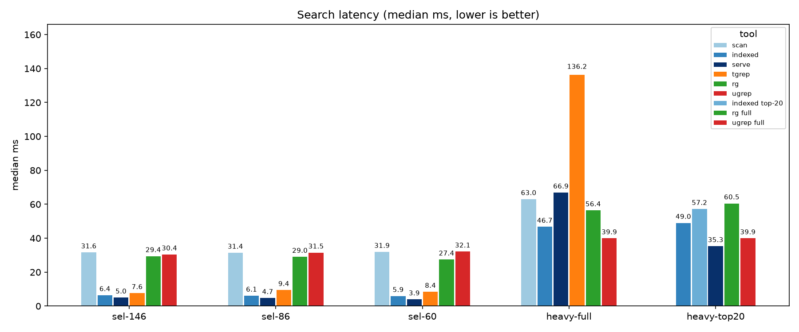

# nkgrep

nkgrep is a ranked code search tool. Given a pattern, it returns the k
highest-scoring matches. It combines a trigram index with best-first
verification: on plain literal queries it returns exactly the match set
of ripgrep, ordered by relevance score.

## Install

```bash
cargo install nkgrep
```

Or build it yourself (crate stays `nkgrep`, the binary is `nkg`):

```bash
cargo build --release
./target/release/nkg --version
```

## Quickstart

```bash
# index the repo once
nkg index . --index .nkg.json

# serve it in the background
nkg serve --index .nkg.json --port 17632 &

# ask for the 20 best hits
nkg --port 17632 --top 20 -- 'TODO|FIXME'
```

No server? No problem — plain one-shot search works too:

```bash
nkg -- 'pattern' src
```

Each hit comes back as one JSON object per line:

```json
{"path":"a.txt","line":1,"text":"hello world","score":-4.000001}
```

## Performance

Same-machine medians after one warmup, every match set identical to
ripgrep's — read it off the chart:



The bar to clear lives in `bench/bench_index.py`: gate A (indexed
matches ripgrep exactly), gate B (the index pays for itself on
selective queries), gate C (top-20 answers no slower than a ripgrep
full run).

## Learn More

- Bench (`bench/README.md`) — full numbers, corpora, and how to re-run everything.
- Man (`man/nkg.1`) — every flag, exit code, and example (`man -l man/nkg.1`).
- Completions (`completions/`) — shell setup for bash, zsh, and fish.
- Src (`src/README.md`) — architecture and extension points.
- Tests (`tests/README.md`) — match-set equality contract and fixtures.

## License

Apache-2.0 — see [LICENSE](LICENSE).
